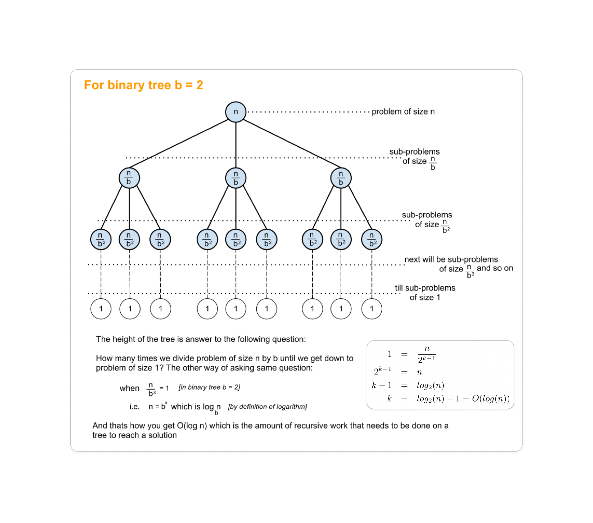

> # **```Binary Search```**

Searching in an array can cost linear time with most naive full length array searching. By utilizing binary search algorithm we could be cut down the time complexity of to a logarithmic complexity if the array is sorted.

**Mid value overflow**: We determine mid vlaue by adding first and last index value, after that the result is divided by 2. But it could be possible that addition of those two index values overflows the range. So, mathematically we use another formula:
```cpp
mid = start + (end - start) / 2
```

### Depend on array order binary search has three variations: 
1. **Ascending order binary search**: On the left side of mid has the smaller values, and on the right of the mid it contains higher values.
   ```cpp
   ....
   ....
      else if (array[mid] > target)
         end = mid - 1;
      else
         start = mid + 1;
   ....
   ....
   ```
2. **Descending order binary search**: Left side of mid has higher value and right side of mid has higher values. 
   ```cpp
   ....
   ....
      else if (array[mid] > target)
         start = mid + 1;
      else
         end = mid - 1;
   ....
   ....
   ```
3. **Order-agnostic array**:
   ```cpp
   ....
   ....
      else if ((arr[mid] > target && arr[start] > arr[end]) 
               || (arr[mid] < target && arr[start] < arr[end]))
         start = mid + 1;
      else
         end = mid - 1;
   ....
   ....
   ```

## ```How to figur out Binary Search questions```
1. Typically questions related to binary search mention the keyword "sorted" in their description.
2. Whenever there is a possible range (range is always sorted) of answers then we can apply binary search.
3. 

### Algorithm
1. If the array is sorted, determine the mid value and compare it with the target value you're looking for. 
2. If the target is not matched to the middle value, then it may be left or right side. Determine which side it should and discard the other side. 
   1. 


## Rotated sorted array 


After rotating an array of size 'n' times, it will return to its original arrangement.


## Lower bound and Upper bound
Lower bound: Array এর মধ্যে কোন element **x** এর lower bound হলো
- **x** যদি  array এর মধ্যে থাকে, তাহলে **x** নিজেই lower bound
- **x** যদি না থাকে, তাহলে **x** এর পরবর্তী বড় যে সংখ্যাটি array তে থাকবে সেটা lower bound

Upper bound:
- কোন element **x** এর upper bound সবসময় তার থেকে পরবর্তী বড় যে সংখ্যাটি array তে পাওয়া যাবে সেটা 

## Binary Search on Answer
Given an array is not sorted but binary search algorithm is still be applicable but but it requires a suitable criteria or condition for conducting the binary search.

## Interpolation Search

&nbsp;

## **```Complexity Analysis```**

