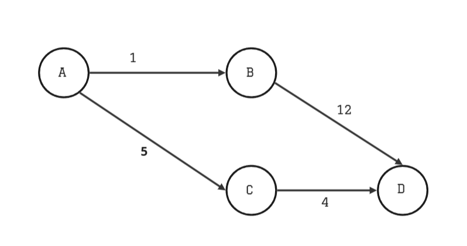
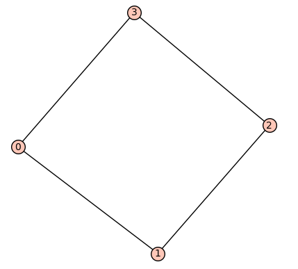
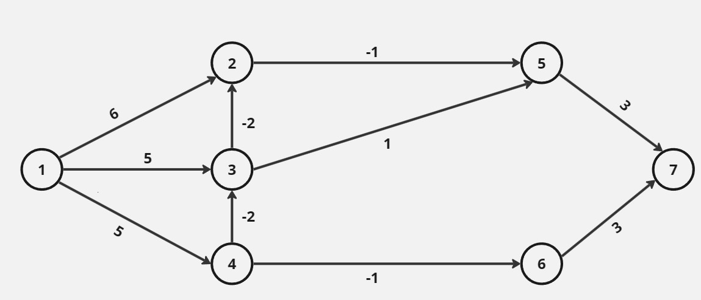
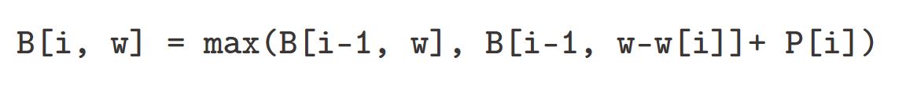
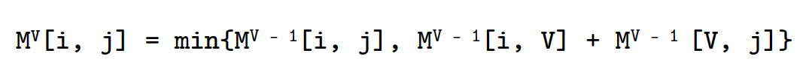
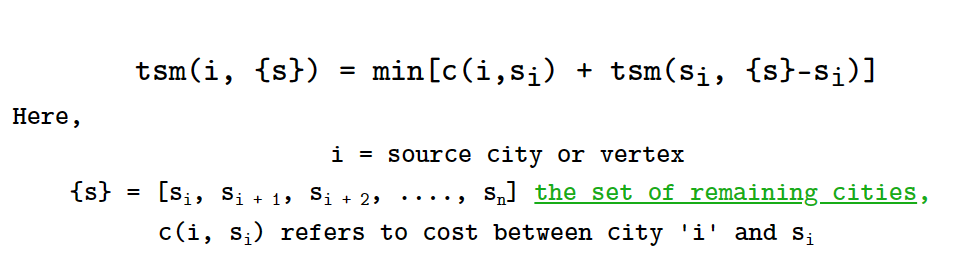

> # **```Algorithm: Final Term```**

## **Syllabus**
1. Optimization problem 
   - Greedy Method
   - Dynamic Programming
2. Job Sequencing with Deadlines - (Greedy)
3. Minimum Spanning Tree (MST)
   - Prim's Algorithm (Greedy - MST)
   - Kruskal's Algorithm (Greedy - MST)
4. Dijkstra's Algorithm (Greedy - Single Source Shortest Path)
5. Bellman-Ford Algorithm (DP - Single Source Shortest Path)
6. Floyd-Warshall Algorithm (DP - All Pair or Multi-Source Shortest Path)
7. Multistage graph (DP)
8.  KMP (String Matching or Substring Finding Algorithm)
9.  Rabin-Karp (String Matching or Substring Finding Algorithm)
10. Disjoint Set Union (Data Structure for Kruskal's Cycle/Loop Detection)
11. Traveling Salesman Problem (TSP) - (DP)
12. Longest Common Subsequence (LCS) - (DP)
13. 0/1 Knapsack - (DP)

&nbsp;

## **```Optimization problem```**
An optimization problem is a kind of problem that requires to have a best possible solution from a set of possible solutions. We can define optimization is two kinds:
1. **Minimization**: Minimize cost.
2. **Maximization**: Maximize profit.

Any optimization problem depends upon a particular goal that needs to acheive either by maximizing or minizing the **objective function**. Here, the objective function defines the goal or objective of the problem we're trying to acheive. In the knapsack problem, our task was to maximizing profit by picking up those items that can fit within the limited weight constraint.

**Optimal solution**: The optimal solution is most suitable solution among all possible solutions that satifies the objective function. 

Here are some popular algorithms that are used to solve optimization problems:

## <p align="center"><b>Greedy Algorithm</b></p>

Greedy algorithms make decisions at each step that seem optimal at the moment, without considering the future consequences.

### **Drawbacks or problems with Greedy method:**
1. Greedy algorithms make locally optimal choices at each step, hoping that these choices will lead to a globally optimal solution.
2. They make the best possible decision at each step without considering the overall effect on the final solution.
3. Greedy algorithms are generally simple, easy to implement, and have low time complexity.
4. However, greedy algorithms do not guarantee an optimal solution in all cases and may lead to suboptimal results.
5. Greedy takes decision in a single pass imedietly. 
6. Greedy method doesn't gurantee the most optimal solution always.

 
Here the greedy method choose, **A → B → D** as the optimal solution, but the optimal path is **A → C → D**.

> ## **```Minimum Spanning Tree (MST)```**
A MST is a tree derived from a graph whose total cost is minimized by summing the weights of any arbitrary (vertices - 1) edges.

Here are some coditions to be fulfilled to be a MST:  
- It is a subset of a graph, also said to be a subgraph. Since MST is a tree, so the subgraph shouldn't have any cycle in it.
- It should contain all vertices of the graph, which it has derived. 
- Should contain no cycle.
- All vertices are connected, while minimizing the total edge weight or cost.
- No new edges can be added or removed.

Suppose we have a graph as below:  
  
The graph properties are, **G(V, E) = (4, 4)**, where **V** is number of vertices and **E** refers to number of edges.  

We have to form a MST, **S'** such that, 
**S'(V', E') = S'(V, |V| - 1)** 

**Algorithms to find MST**: 
## <p align="center">1. Prims algorithm</p>
1. Delete self loop from the graph.
2. Delete maximum parallel edges from the graph.
3. Can't have any cycle.  
4. Select any edge includes two vertex from the graph.
5. The furtherest edges that to be selected, will also be minimum among the vertices includes in the selected edge for the MST.

## <p align="center">2. Kruskal algorithm</p>

**Algorithm**: Always select the minimum cost edge in the graph, but if it is creating a cycle or loop then don't select and proceed to the next minimum cost edge.

While implementing the algorithm it seems very to the point, until and unless cycle comes into picture. To handle whether our selected edge is creating a cycle or not we've to utilize a different type of data structure namely **DSU**.

### **Disjoint Set Union (DSU)**
It is a data structure that primarily used with Kruskal's algorithm that help us to find cycle in undirected graph. 

It has three functions:
1. **make()**: Adds new independent node (that is not yet connected) to existing group.
2. **find()**:  Return the parent of the group.
3. **union()**: Submerges two group into a single group.

## <p align="center">2. Optimal merge pattern</p>

## <p align="center"><b>Dynamic Programming</b></p>

1. Dynamic programming is all about solving a sub-problem once and remembering its result and reuse when they appears again.
2. Dynamic programming works on **principle of optimality**. So, minimization or maximization problems can be solved using DP.
3. Dynamic programming solves problem by taking **sequence of decisions**. More simply it means, you've to try out all possible solutions and pick up the best solution. 

Two methods of DP:
1. Top-down approach: Recursion + Memoization 
2. Bottom-up approach: Tabulation

&nbsp;

> ## **```Single Source Shortest Path Algorithms```** 
Single source shortest path algorithm suggests to find a path or way from a source node to destination node with a minimum possible distance.

**Source node**: The very first node represented as **source node** or starting point or initial stage.

**Destination node**: The last node known as destination node or end point or final stage. 

In the best case scenario, there might be one or multiple single source direct paths from source to destination. In this case, we have to select the minimum cost or shortest path, and that will be our result.

On the contrary, there might no single source direct path between source to destination. In this case, we've to go to our destination by using other paths also known as "via nodes". 

**Relaxation:** Relaxation is a process used to update the minimum distance between the source vertex and any other vertex in the graph. In the process we calculate the shorter path to reach from source to a specific vertex. If we find a shorter path than the current path, we replace the current value with the new shortest we just found.

```cpp
if(g[u] + e[u][v] < g[v])
    g[v] = g[u] + e[u][v];
```

Since here we have to minimize value this problem can solved using greedy approach or dynamic programming.

## Dijkstra (shortest path) algorithm - **Greedy Method**

**Why Dijkstra and greedy method?**

Determining shortest path is all about finding the minimum distance from source to destination where we're minimizing distance value which is also said to be an optimization problem. As we know, optimization problems can be solved using greedy approach.

**Initial phase**: Value of source vertex or node will be set to 0, nodes that directly connected to the source node will also be calculated. All other vertices or nodes will be set as infinity.

**Dijkstra's algorithm selects the vertex that has less value at the current time and relax the connected vertex to selected one.**

**Time complexity**: O(n^2)

### **Advantages**
1. Dijkstra algorithm works with both directed and undirected graph.

### **Disadvantages**
1. Dijkstra algorithm doesn't works with negative weights.

## Bellman-Ford Algorithm - **Dynamic Programming**

**Task**: As definition, single source shortest path says, starting from a source node you've to reach till the destination within shortest distance possible. 

<ins>**The Bellman-Ford algorithm works by iteratively relaxing the distances to all vertices from the source vertex. The iteration is repeated |V|-1 times, where V is the number of vertices in the graph.**</ins>

Benefit using this algorithm over Dijkstra algorithm of shortest path that, Dijkstra doesn't work properly if edges are negative. 

Initially distance of the source vertex is set to value 0 since going from source to source doesn't cost anything and all other vertices are set to value as infinity as we don't know how much it will cost to going from source that unknown node. 



Here in the graph we have total number of vertices, |V| = 7  
So, we have to run the code for |V| - 1 = 7 - 1 = 6 times


**Optimization**: . If the distances to all vertices do not change after a certain number of iterations, then this means that the algorithm has converged and the shortest paths have been found. Therefore, we can stop the iterations once the results duplicate. In this way, we can skip iterations and optimize our algorithm.

**Time complexity**: O(|E|.|V|) = O(n^2)  
**Time complexity (complete graph)**: O(n^3)

 ## 0/1 Knapsack Problem - **Dynamic Programming**
**Problem statement**: You'll be given a set of product weight (w) and profit (p). Along with this, you're given a bag with a weight limit (limit). The total weight of all product is definitely higher than the bag's weight capacity. Your task is to pick some product in such a way that get you maximum profit also doesn't exceeds the given limit (less than equal to the limit).

The algorithm we will be using here is a dynamic programming based tabulation method, since the problem says to get a maximum profit. 0/1 means either we pick a product, or left it. 

### **Process**
- Create a matrix that has column size of max weight or capacity of the bag. 
- 


**Caution**: You can't split items. In the greedy solution of **Kanpsack problem** we can work with fraction of items. 

### <p align="center">**Formula for solving this problem**</p>


&nbsp;

> ## <p align="center">**```All pair or multi source shortest path```** </p>

Previously we've learned about single source shortest path, where we start from a specific source node and find the shortest path till destination. But here all pair shortest path doesn't have a source node, we've to consider shortest path from every single node.

Find all pair shortest path using greedy algorithms: 

Here, we already learned about **Dijkstra algorithm**, which has the complexity of **O(E log V)**. But, dijkstra algorithm works on a single node to destination node and if we implement this algorithm to all pair shotest path it will take,  
**V * E log V = V * V^2 log V = V^3 log V** which is quite inefficient. 

On the other hand, **Bellman-Ford** reqiures **V^4** to solve the problem.

To solve this particular problem with less time complexity the **Floyd-Warshall** algorithm could be utilized.

## Floyd-Warshall Algorithm - **Dynamic Programming**

### **Process**
- Create a distance matrix.
- Self loop will taken as edge value 0
  - In the actual implementation using matrix the diagonal cells creates self loop so mark the diagonal cell as value 0.
- For any non existing edges the value considered here is ∞ (infinity)
  - In case of actual implementation in any programming language, the value of that particular cell where there is no edge exist between two vertex  would be initialized with maximum value of that particular data type range. 

### <p align="center">**Formula for solving this problem**</p>



- Create matrix for each vertex. 
- If current matrix is V then mark it's row (V, x) and column (V, x) with previous matrix value.

Advantage: 
1. Works with both negative and positive edges but with no negative cycles (when sum of edges of a cycle or loop in the graph is negative, additionally for an undirected graph there should no negative value edge exist).
2. Time complexity is comparatively lower than other algorithms. 


## Travelling Salesman Problem (TSP) - **Dynamic Programming**
With greedy method the result is not guaranteed to be optimal (maybe efficient not optimal). In contrast, in the DP algorithm we will check all possibilites and then decide the minimum cost.

1. Starting from a city (source vertex), visit all possible path or routes that covers all other cities and at the end return to the city where you started (come back to the source vertex).
2. A traveller has to visit all the cities once but not more than it.

### <p align="center">**Formula for solving this problem**</p>


## Longest Common Subsequence (LCS)

### Multistage graph
A multistage graph is a directed weighted graph with a special property of having stages (set of nodes or vertices), where no vertices from a similar stage has edge between them. 

**Source node**: The very first node represented as **source node** or starting point or initial stage.

**Destination node**: The last node known as destination node or end point or final stage. 

<ins>**Our task is to reach to the destination node starting from the source node within minimum cost.**</ins>


## **```Suitable DS for various algorithm```**

### <ins>**Choosing DS for Prim's algrithm**</ins>

Since Prim's is a greedy algorithm to find minimum cost spanning tree. In greedy it consider locally optimal result, so each step we have to find the minimum result. 

After learning about how prim's algorithm works I insist choosing ***Min Heap*** as data structure. Here are my two reasons to use min heap:

1. **Sorts value automatically**: **Min Heap** or C++ STL <ins>priority_queue</ins> as the main DS is a better option than other data structure since min heap automatically sorts in ascending order. While other data structure has the blunder of not auto sorting which may explicitly done by programmer and that eventualy increases the complexity.

2. **Time complexity**:  
Inserting a new value (worst case complexity): O(log n)  
Inserting 'n' values (worst case complexity): O(n log n)  

**Implementation:**

```cpp
class values
{
public:
    int weight;
    int to;
    int from;
};

priority_queue<values, vector<values>, greater<values> pq;
```

### <ins>**Choosing DS for Kruskal's algrithm**</ins>
To implement Kruskal's algorithm we need an additional data structure namely **DSU (Disjoint Set union)**. This is used to find whether choosen edge is forming any cycles in the graph.

Time complexity of DSU: O(4α) per iteration, which is nearly constant. 

### **To store the edges we can use between:**

1. **Priority queue**: With priority queue the grand total complexity becomes O(E log V). The benefit of priority queue is it doesn't require to sort explicitly.

2. **Vector of pair of pair**: With vector of pairs we have to beforehand and so, grand total time complexity stands O(E log V).

Although both data structure are providing us the same complexity, here are some of my key observations: 

1. Implementing using priority queue is messy, vector of pair more off a cleaner approach as well as easy to implement.
2. In some rare conditions like sparse graph using priority queue is slightly effecient.
3. Space complexity of priority queue is more than vector of pair.
4. Although both implementations are same time complexity but priority queue is more faster in real world scenario.

In conclusion, I found vector of pair concise. Here are my implementation, 

```cpp
vector<pair<int, pair<int, int>>> edges;
```
Another alternative, 
```cpp
vector<tuple<int, int, int>> edges;
```

### <ins>**Choosing DS for Dijkastra's algrithm**</ins>

Dijkastra is the single source shortest path finder algorithm. 

We can choose between two data structures to implement Dijkastra's algorithm, such as:
1. Priority queue (actual implementation "Heap")
2. Set

Here are my comparisons:

| **Data Structures** | Time complexity |
| ------------------- | --------------- |
| **Priority Queue**  | O(E log V)      |
| **Set**             | O(E log V)      |

**My observations**:
1. Priority queue provides faster access to the minimum value.
2. Priority queues are more efficient for updating elements.
3. Priority queues are more efficient for working with large graphs. 
4. Operations of priority queue are typically faster due to it's implementation using with Heap. 

Choosing **priority_queue** as the data structure would be a better decision.

### <ins>**Choosing DS for KMP string pattern matching algorithm**</ins>

KMP algorithm effeciently searches pattern or substring in a given text within O(N + M) complexity.

The algorithm concludes two main components: 
1. Text or given string: The given text may be a string or array of character as input. Where while designing the algorithm, we should take either **vector** or traditional **array of characters**.
2. LPS array of pattern: We can go for either **array** or **vector**.

### <ins>**Choosing DS for Rabin-Karp string pattern matching algorithm**</ins>

1. Text or input string: C++ string or array of characters. 
2. Data strucuture: The suitable data structure is a hash function. A hash function generates unique value for the pattern, if the pattern matches it indicates that the generated hash value is exist in some substring of the text. To implement the hashcode it doesn't require anything else an integer variable.

**Caution**: The hashcode could be huge in number, this may also overflow the range integer capability. So, we must keep a mod value thus it is possible to decrease the actual hashcode size.

**Implementation**:
```cpp
long long generateHashValue(string str, int modVal)
{
    int size = str.size();
    long long hashCode = 0;
    int n = size - 1;

    /// hash function: is generating hash value from a particular input
    for (int i = 0; i < size; ++i)
    {
        hashCode += str[i] * pow(size, n--);
    }

    return hashCode % modVal;
}
```

### <ins>**Choosing DS for Floyd-Warshall algorithm**</ins>
Floyd-Warshall is an efficient algorithm to find all pair shortest path by using **Dynamic Programming**.

Algorithm components: 

**Distance table**: The distance table is used to store shortest distance between all pair of vertices. We can choose between 2D array (C++ vector of vector or traditional 2D array) or hashmap(C++ map) to create the distance table.

Here are observations to choose between two: 
1. 2D array gives us O(1) or constant time access to elements.
2. Since it is a DP algorithm, there is no better option than using 2D array.
3. 2D array requires more space.
4. Map is less space consuming.
5. Map has a complex implementation downside. 

Since 2D array for the distance matrix in the Floyd-Warshall algorithm is the standard and more straightforward approach I choose 2D array:

**Implementation:**
```cpp
int distance[N][N]{INT32_MAX};
```

### <ins>**Choosing DS for Bellman-Ford algorithm**</ins>
Bellman ford is a dynamic programming based single source shortest path finder algorithm. The primary algorithmic component is the distance table which is required to track of distance between source node and other nodes.

Data structures:
1. Traditional 2D array

   Implementation
   ```cpp
   int distance[N][N]{INT32_MAX};
   ```
2. Vector of edges:  

    Implementation
   ```cpp
   class Edges
   {
    pubilc:
    int source;
    int distance;
    int weight;
   };

   vector<Edges> distance;
   ```

**Observations**:
1. 2D array is the widely used implmentation for this algorithm.
2. 2D array is good for representing dense graph. In contrast, for a sparse graph 2D array is waste of spaces. 
3. Implementation of vector of edges is a bit tricky. 
4. Vector of edges is more memory efficient.

**Conclusion:**  As a beginner to dynamic programming (DP), I would choose to use a 2D array to store the distance matrix. Additionally, I would prefer to use a vector of edges implementation for the code base that requires a precise codes.


### <ins>**Choosing DS for Backtracking**</ins>

The backtracking is a technique rather than a generic algorithm. Choosing data structures for backtracking is specific to usecases. Various data structures could be used: 
1. Array
2. Stack 
3. Hashmap 

**Observations**
1. Backtracking with DP referred to as "Backtracking with Memoization" requires array to storing subproblems.
2. Other data structures should be use on need based.

**Conclusion**: I would like to use the data structure that suits the specific usecase.

### <ins>**Choosing DS for Longest Common Subsequence (LCS)**</ins>

The problem says, for given two string you've to find the common subsequence that is longest as well. 

**Subsequence**: The subsequence of a string is obtained by deleting one or more or no character without changing the actual order of the characters.

For example, The Longest Common Subsequence (LCS) of "NXPCS" and "XYS" is "XS".

**Data structure**: To solve this problem using DP, it requires a 2D array to store the length of the LCS between substrings of the two strings.

Implementation:
```cpp
/// vector of vector implementation
vector<vector<int>> store(str1.size(), vector<int>(str2.size()));

/// 2D array implementation
int store[str1.size()][str2.size()];
```
**Observation and conclusion**:
In my openion 2D array is easy to implement.

### <ins>**Choosing DS for Travelling Salesman Problem**</ins>

The Traveling Salesman Problem (TSP) is a DP based optimization problem in which a salesman has to visit a given set of cities once, and come back to the starting city. 

**Data structures**: The problem can be solved by storing the distances between the cities. Two widely used data structures for storing this data are C++ maps (hashmap data structures) and 2D arrays (matrices).

**My observations**:
1. 2D array is easy to implement, whereas map implement is not used frequently.
2. 2D array is more space consuming, but map can store multiple values at a single key that is why map is space efficient.

**Implementation**:
```cpp
/// 2D array implementation
vector<vector<int>> distance_matrix;

/// map implementation
map<pair<int, int>, int> distance;
```

**Conclusions**: 
1. Map is a good choice when we have a large number of cities in the problem and the graph is sparse. 
2. 2D matrix is good choice for easy implementation, when graph is dense or number of cities are not that much.

### <ins>**Choosing DS for 0/1 Knapsack Problem**</ins>
**Problem statement**: You'll be given a set of product weight (w) and profit (p). Along with this, you're given bag with a weight limit (limit). The total weight of all product is definitely higher than the bag's weight capacity. Your task is to pick some product in such a way that get you maximum profit also doens't exceeds the given limit (less than equal to the limit).