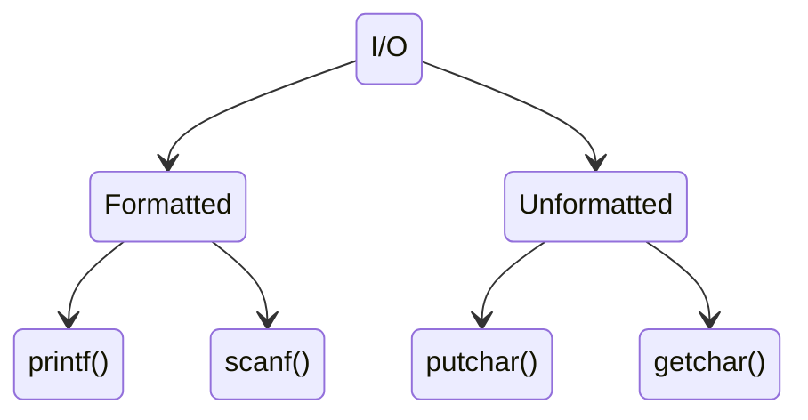

> # ```Function```

## <p align="center"><b>Functions role in algorithms</b></p>

1. Divide complexity into various minimal parts, thus work around those smaller portion make the algorithm to maintain DRY **(Don't Repeat Yourself)** principle and debug easily.
2. Algorithms expressed

Two types of function are seen in C and C++, these are:

1. **Built-in function**: C and C++ has many built in functions and methods (as for C++ STL) to reduce boilerplate and redundancy. Many popular algorithms are also written if form of built-in library function.

2. **User defined function**: Also known as sub-routines. Meanwhile, programmers construct . Here is three parts of user defined functions:
    - Function decleration
    - Function call
    - Function definition

3. **Five rules of variable naming**:
Variable names are also said to be **identifiers**. An idetifier is an unique name to identify various entity of a programming language, such as  variable, function, class, structure or a constant, etc. Here are the five rules that one should follow while declaring a variable:

    - An identifier can only contain letters (a-z, A-Z), digits (0-9) and underscores(_). Special keywords are not allowed.
    - The first letter of an identifier has to be either a letter (a-z, A-Z) or underscore(_). So, declaring an identifier that begins with a number is invalid.
    - Can't contain any whitespace or any special characters (!, #, %, @, etc.).
    - Can't use a reserved keyword as a variable name.
    - Identifiers are case-sensitive. So, the same name in uppercase and lowercase differs as two variables. For instance, ```int age``` and ```int age are not the same and are identified as two different variables.

4. **Parameter**: A function can be passed with data input while it invokes. The data described as parameter or arguments. Here are two types of parametes briefly discussed:

    - Formal parameter: Formal parameters are declared in a function as a variable of a specific data type yet to receive.

    ```
    int sum(int a, int b)
    {
        return a + b;
    }
    ```

    Here, 'a' and 'b' are two variable defined as integer variable.

    - Actual parameter: The actual value that passed into the function by a caller. Actual parameters are also known as **'arguments'**.

    ```
    sum(10, 20); /// result: 30
    ```

    We've passed 10 as value of variable 'a' and 20 in place of variable 'b'.

5. **Six sections of C++ a program**:
    - Link section: header files or imports of various library.
    - Documentation section: Stay above link section as manual of the program file.
    - Definition section

        ```
        #define MAX 1e6
        ```

    - **Global declaration section**: The global scope refers to the area within a program that is outside and above the scope of the main function or any other function. The lifetime of global instance like variable, or declarations are validate until the program terminates.

    ```
    # include <bits/stdc++.h>
    using namespace std;

    /* Global section */

    /// declaration of boolean array
    bool arr[1e7];

    /// declaration of global variable
    const int MAX = 1e6;

    int main()
    {
        return 0;
    }
    ```

<details>
<summary>Quiz</summary>

1. What feature 'const' keyword provide in C++?  
    👉 **Can't redefine** a variable once declared.  

2. What void function can't do?  
    👉 **Can't return** any specific type of value.

3.

</details>

## <p align="center"><b>I/O classification</b></p>



&nbsp;

&nbsp;

## <p align="center"><b>Time complexity</b></p>

Algorithm analysis requirements:
|  ```Terminology``` |
|:----:|
| Time complexity|
| Space complexity |
| Network consumption |
| Power consumption |

1. A program that has a lower time complexity will run faster compared to a program with a higher complexity.
2. Algorithm that requires less execution (lower in terms of time complexity) time expenditure more space. On the contrary, an algorithm with a higher space complexity will have a lower time complexity( require less execution time.)

    The greater the time complexity, the less space it would require.
    The greater the space complexity, the less its time complexity would be.

    Here is an example so see the difference in action:

    ```
    Example 1: Swapping without third variable
    a = a + b
    b = a - b
    a = a - b

    Example 2: Swapping using an extra variable
    t = a
    a = t
    b = t
    ```

    In the first example, we had to do a lot of calculation, that requires computation power which increases time complexity. On the other hand comparing with the second example, there was no calculation involved hence no computatoin has done. Rather it take an extra variable or space to do it's work.

3. An application with lower space complexity will typically have a shorter startup time

4. Computer can compute $10^3$ operations in a second.

&nbsp;

## <p align="center"><b>STL (Standard Template Library)</b></p>

STL utilizes class based **Object Oriented Programming (OOP)** paradigm to endorse 4 kind of components to let programmer use complex parts vividly. These components includes:

1. **Algorithms**: Various algorithms that widely used in programmers life.
2. **Containers**:
3. **Functions or methods**:
4. **Iterators**:
