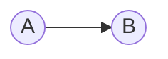
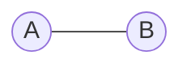
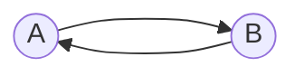
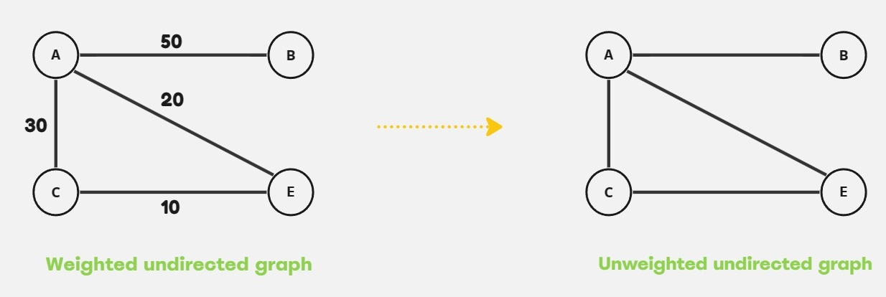
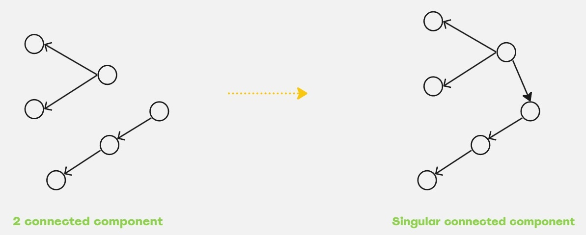

> # **```Graph```**

Graph is a non-linear data structure which contains set of nodes may or may not connected with other nodes. 

**Non-linear** simply means, <ins>one to many connection</ins> and whereas, **linear** means <ins>one to one connection</ins>.

Nodes are said to be vertex (that holds various data) and the connection or relation between any two node is said to be an edge. We represent it as, **G(V, E)**

## <p align="center">Graph Terminologies</p>
Depending upon direction of edges, graph could be classified into two types: 

1. **Directed graph**: Here a specific node pointng to the other node. Directed graph is an example of **one way relationship**.

Here the relation between node **A** and **B** stated that A node is connected toward B node not similarly, B node is connected towards A.

1. **Undirected graph**: Both nodes are poninting to each other. Undirected graph is an example of **bidirectional relationship**, where two nodes are co-related to each other.


**Alternative representation**, 


Here the relation between node **A** and **B** stated that A node is connected toward B node as well as B node is connected toward node A.

Graph edges, also known as connection paths between two nodes, can have values or weights. The associated values of edges are useful in real-world scenarios such as maps, GPS tracking, path finding, finding the minimum cost path to a destination, and network connections.

Depending on this edge value criteria graph can be classified into two types: 
1. **Weighted graph**: In this graph, edges has values assosiated.
2. **Unweighted graph**: Edges don't have any value assosiated to it. 



### Tree (as a graph)
A special type of graph if successfully maintain the following conditions: 
1. Should have only one or singular **connected component**. This means that all the nodes in the tree should be inter-connected to each other in a way that there are no isolated nodes left. The sigular connected component ensures a path in which any node can be visited throughout the tree, so there is no single or multiple nodes are left alone.
   
2. Can't have any **cycles** in the graph. This can be ensured by the condition, **edges = vertices - 1**.

**A graph is said to be a tree if it has a singular component and the number of edges in the graph is equal to vertices - 1**.

### Connected Components

> Number of minimum edges need to connect 'n' (n > 1) connected components or making a single connected component, e = (n - 1)


## <p align="center">Graph Representations</p>

1. Adjacency matrix
      - Space consuming. 
      - Uses 2D array. 
      - Size of the matrix depends on number of vertices. The matrix size is int matrix[**node_count * node_count**].
      - **Preferred to use with dense graph.**
2. Adjacency list
     - Space efficient.
     - Size of adjacency list depends on number of edges it has. 
     - **Preferred to use with sparse graph, such as tree.**
3. Edge list


## More types of graphs
1. **Bipartite graph**: In this type of graph total number of vertices are **divided into only two sets**, where vertices of a similar set not connected with each other, but they can have connection it's opposite set. 


> Bipartite graph can only have two vertices set, where for more than two vertices set there is also a variant namely **k-partite** graph.

2. **Complete graph**: Every vertex is directly connect to all other vertices in the graph.
      -  A complete graph is cyclic.
      -  A complete graph has n * (n - 1) / 2 number of edges.


3. **Rooted Graph**: The root is explicitly mentioned or the root node or vertex can be recognized in this graph.
   - **A tree is a rooted graph.**

4. **Unrooted Graph**: In this graph, root node isn't fixed, so any vertex could be the root node or vertex.
   
5. **Directed Acyclic Graph (DAG)**: 
      - Acyclic means no cycle, such as a tree is an acyclic graph. 


