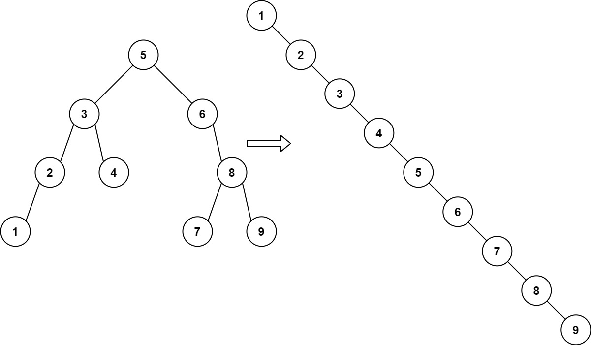
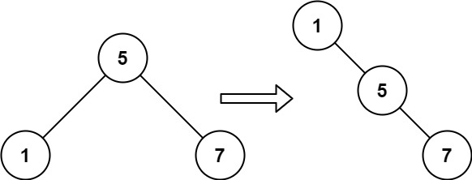

---
> # [**LeetCode 897. Increasing Order Search Tree**](https://leetcode.com/problems/increasing-order-search-tree/)


<details>
<summary>Example 1</summary>



```cpp
Input: root = [5,3,6,2,4,null,8,1,null,null,null,7,9]
Output: [1,null,2,null,3,null,4,null,5,null,6,null,7,null,8,null,9]
```
</details>

<details>
<summary>Example 2</summary>



```cpp
Input: root = [5,1,7]
Output: [1,null,5,null,7]
```
</details>

&nbsp;

# **`Intuition`**

> ## Observation 1 (Bruteforce, Binary Tree InOrder Traversing):

<details>
<summary>Explanation</summary>

1. We will create a new tree and return that tree. 
2. As the input tree is a BST, inorder traverse will occur an increasing structure. 
3. While we traverse in inorder manner we just need to append each node as new tree's right child and left child should remain empty.

</details>


### Solution

<details>
<summary>C++</summary>

```cpp
// Time Complexity:
// Space Complexity:

class Solution {
public:
    void createIncreasingBST(TreeNode* root, TreeNode*& newTree) {
        if(!root) 
            return; 

        // inorder traversing
        createIncreasingBST(root->left, newTree);

        // work during inorder process 
        newTree->right = new TreeNode(root->val);
        newTree->left = nullptr;
        newTree = newTree->right;

        createIncreasingBST(root->right, newTree);
    }

    TreeNode* increasingBST(TreeNode* root) {
        TreeNode *newTree = new TreeNode(0), *head = newTree;
        createIncreasingBST(root, newTree);
        return head->right;
    }
};

```
</details>


