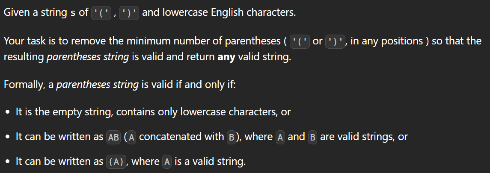

---
> # [**LeetCode 1249. Minimum Remove to Make Valid Parentheses**](https://leetcode.com/problems/minimum-remove-to-make-valid-parentheses/)



<details>
<summary>Example 1</summary>

```cpp
Input: s = "lee(t(c)o)de)"
Output: "lee(t(c)o)de"
Explanation: "lee(t(co)de)" , "lee(t(c)ode)" would also be accepted.
```
</details>

<details>
<summary>Example 2</summary>

```cpp
Input: s = "a)b(c)d"
Output: "ab(c)d"
```
</details>

<details>
<summary>Example 3</summary>

```cpp
Input: s = "))(("
Output: ""
Explanation: An empty string is also valid.
```
</details>

&nbsp;

# **`Intuition`**

> ## Observation 1 (Stack and hashmap solution):

### Solution

<details>
<summary>C++</summary>

```cpp
// Time Complexity: 
// Space Complexity: O(N)
class Solution {
public:
    string minRemoveToMakeValid(string s) {
        int n = s.size();
        string result = "";
        stack<pair<char, int>> st;
        map<int, char> notIncludeIndexes;

        for (int i = 0; i < n; ++i) {
            char ch = s[i];

            if (ch == '(') {
                st.push({ch, i});
            } else if (ch == ')') {
                if (!st.empty())
                    st.pop();
                else {
                    notIncludeIndexes.insert({i, ch});
                }
            }
        }

        while (!st.empty()) {
            auto current = st.top();
            notIncludeIndexes.insert({current.second, current.first});
            st.pop();
        }

        for (int i = 0; i < n; ++i) {
            if (notIncludeIndexes[i] == s[i])
                continue;
            else
                result += s[i];
        }

        return result;
    }
};
```
</details>


> ## Observation 2 (Stack and set solution):

<details>
<summary>Explanation</summary>
1. We're taking a stack which stores the index of invalid pairs of the character ")".
2. The stack might have opening parenthesis left, which needs to be count separately. 
3. At the end, we will compare with the invalid indexes present in the **set**, and ignore them. Rest of the characters should be added to the result string.  
</details>


### Solution

<details>
<summary>C++</summary>

```cpp
class Solution {
public:
    string minRemoveToMakeValid(string s) {
        int n = s.size();

        stack<int> st;
        unordered_set<int> remove_idxs;
        string result = "";

        for (int i = 0; i < n; ++i) {
            if (s[i] == '(') {
                st.push(i);
            } else if (s[i] == ')') {
                if (st.empty()) {
                    remove_idxs.insert(i);
                } else {
                    st.pop();
                }
            }
        }

        // string with only opening parenthesis "((("
        while (!st.empty()) {
            remove_idxs.insert(st.top());
            st.pop();
        }

        for (int i = 0; i < n; ++i) {
            if (remove_idxs.find(i) != remove_idxs.end())
                continue;
            else
                result += s[i];
        }

        return result;
    }
};
```
</details>


