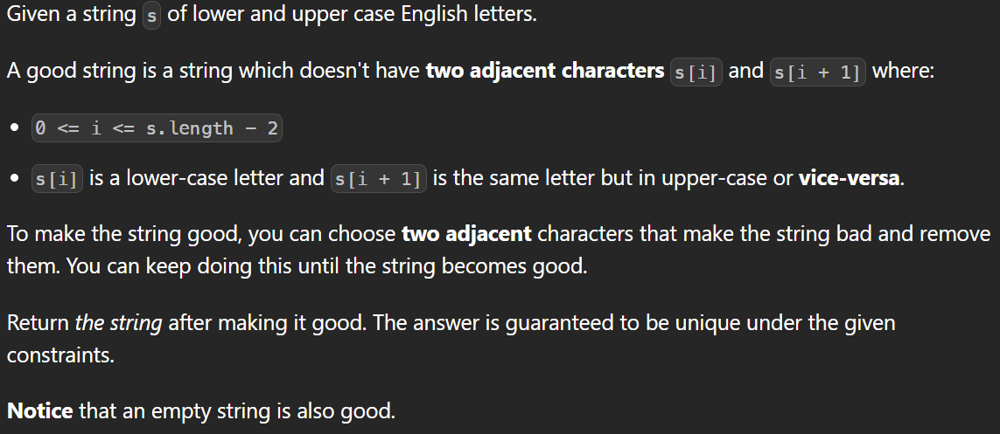

---
> # [**LeetCode 1544. Make The String Great**](https://leetcode.com/problems/make-the-string-great/)



<details>
<summary>Example 1</summary>

```cpp
Input: s = "leEeetcode"
Output: "leetcode"
Explanation: In the first step, either you choose i = 1 or i = 2, both will result "leEeetcode" to be reduced to "leetcode".
```
</details>

<details>
<summary>Example 2</summary>

```cpp
Input: s = "abBAcC"
Output: ""
Explanation: We have many possible scenarios, and all lead to the same answer. For example:
"abBAcC" --> "aAcC" --> "cC" --> ""
"abBAcC" --> "abBA" --> "aA" --> ""
```
</details>

<details>
<summary>Example 3</summary>

```cpp
Input: s = "s"
Output: "s"
```
</details>

&nbsp;

# **`Intuition`**

> ## Observation 1 (Stack solution):

<details>
<summary>Explanation</summary>

1.

</details>


### Solution

<details>
<summary>C++</summary>

```cpp
// Time Complexity:
// Space Complexity: 
class Solution {
public:
    string makeGood(string s) {
        stack<char> st;

        for (char ch : s) {
            if (!st.empty()) {
                char prev = st.top();
                int difference = abs(prev - ch);
                if (difference == 32) {
                    st.pop();
                } else {
                    st.push(ch);
                }
            } else {
                st.push(ch);
            }
        }

        string result = "";
        while (!st.empty()) {
            result = st.top() + result;
            st.pop();
        }

        return result;
    }
};
```
</details>


> ## Observation 2 ():

<details>
<summary>Explanation</summary>

</details>


### Solution

<details>
<summary>C++</summary>

```cpp
```
</details>


