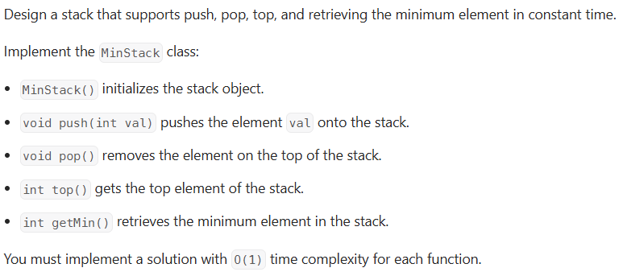

---
> # [**LeetCode 1544. Make The String Great**](https://leetcode.com/problems/make-the-string-great/)



<details>
<summary>Example 1</summary>

```cpp
Input
["MinStack","push","push","push","getMin","pop","top","getMin"]
[[],[-2],[0],[-3],[],[],[],[]]

Output
[null,null,null,null,-3,null,0,-2]

Explanation
MinStack minStack = new MinStack();
minStack.push(-2);
minStack.push(0);
minStack.push(-3);
minStack.getMin(); // return -3
minStack.pop();
minStack.top();    // return 0
minStack.getMin(); // return -2
```
</details>

&nbsp;

# **`Intuition`**

> ## Observation 1 (Stack solution):

<details>
<summary>Explanation</summary>

1. The description didn't ask to implement the stack by yourself, rather it focuses on how you implement the additional feature called **getMin()** method. 
2. We can use a stack of pair for push, pop and top operations within O(1) complexity.
3. To getting the minimum value, we are using pair inside the stack. The second element of the pair indicates the minimum value. So, everytime we push new element it will compare to the previous top element and update to current pair's second value. And when the method **getMin()** get invoked it'll simply show the top element's second pair value. 

</details>


### Solution

<details>
<summary>C++</summary>

```cpp
// Time Complexity: O(1)
// Space Complexity: O(2N)
class MinStack {
public:
    // current_value, min_value
    stack<pair<int, int>> st;

    MinStack() {}

    void push(int val) {
        if (st.empty())
            st.push({val, val});
        else
            st.push({val, min(val, st.top().second)});
    }

    void pop() { st.pop(); }

    int top() { return st.top().first; }

    int getMin() { return st.top().second; }
};
```
</details>
