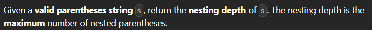

---

> # [**LeetCode 1614. Maximum Nesting Depth of the Parentheses**](https://leetcode.com/problems/maximum-nesting-depth-of-the-parentheses/)



<details>
<summary>Example 1</summary>

```cpp
Input: s = "(1+(2*3)+((8)/4))+1"

Output: 3

Explanation:

Digit 8 is inside of 3 nested parentheses in the string.
```

</details>

<details>
<summary>Example 2</summary>

```cpp
Input: s = "(1)+((2))+(((3)))"

Output: 3

Explanation:

Digit 3 is inside of 3 nested parentheses in the string.
```

</details>

<details>
<summary>Example 3</summary>

```cpp
Input: s = "()(())((()()))"

Output: 3
```

</details>

&nbsp;

# **`Intuition`**

> ## Observation 1 (String only solution):

<details>
<summary>Explanation</summary>

1. Keep in mind that, the given parentheses string is already a valid parentheses string.
2. The only thing we have to do is keeping track or maintain a calculation of open and closing bracket and not include them in the result string.

</details>


### Solution

<details>
<summary>C++</summary>

```cpp
// Time Complexity:
// Space Complexity: 
class Solution
{
public:
    string removeOuterParentheses(string s)
    {
        int cnt = 0;
        string result = "";

        for (auto i : s)
        {
            if (i == '(')
            {
                if (cnt > 0)
                    result += i;
                ++cnt;
            }
            else
            {
                if (cnt > 1)
                    result += i;
                --cnt;
            }
        }

        return result;
    }
};
```
</details>


> ## Observation 2 (Stack solution):

<details>
<summary>Explanation</summary>

1. When the stack is empty this indicates that any upcoming parenthesis is the outermost parenthesis. So, when the stack is not empty only then add the parenthesis to the result string. 
2. For closing tag, we will delete from stack if it is not the outermost parenthesis. The stack size is 1 indicates stack only contains outermost "(". So, delete from the stack and add to result when the stack has size more than 1. 

</details>


### Solution

<details>
<summary>C++</summary>

```cpp
class Solution {
public:
    string removeOuterParentheses(string s) {
        string res = "";
        stack<char> st;

        for (char ch : s) {
            if (ch == '(') {
                if (!st.empty())
                    res += '(';
                st.push('(');
            } else {
                if (st.size() > 1)
                    res += ')';
                st.pop();
            }
        }

        return res;
    }
};
```
</details>


