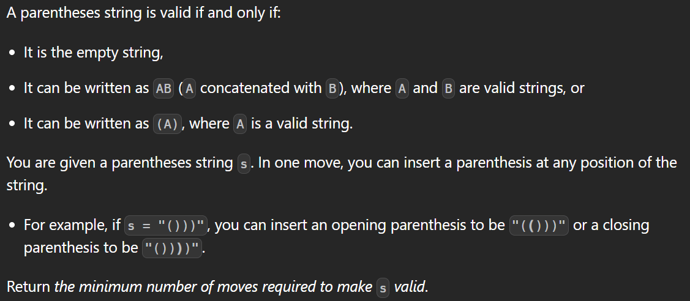

---
> # [**LeetCode 921. Minimum Add to Make Parentheses Valid**](https://leetcode.com/problems/minimum-add-to-make-parentheses-valid/)



<details>
<summary>Example 1</summary>

```cpp
Input: s = "())"
Output: 1
```
</details>

<details>
<summary>Example 2</summary>

```cpp
Input: s = "((("
Output: 3
```
</details>

&nbsp;

# **`Intuition`**

> ## Observation 1 (Stack solution):

<details>
<summary>Explanation</summary>

1. 

</details>


### Solution

<details>
<summary>C++</summary>

```cpp []
// Time Complexity: O(N)
// Space Complexity: O(N)
class Solution {
public:
    int minAddToMakeValid(string s) {
        int value = 0;
        stack<char> st;

        for (auto ch : s) {
            if (ch == ')') {
                if (st.empty())
                    ++value;
                else
                    st.pop();
            } else {
                st.push('(');
            }
        }

        value += st.size();

        return value;
    }
};
```
</details>
