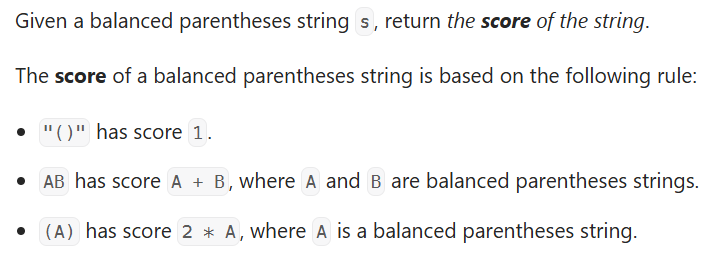

---
> # [**LeetCode 856. Score of Parentheses**](https://leetcode.com/problems/score-of-parentheses/)




<details>
<summary>Example 1</summary>

```cpp
Input: s = "()"
Output: 1
```
</details>

<details>
<summary>Example 2</summary>

```cpp
Input: s = "(())"
Output: 2
```
</details>

<details>
<summary>Example 3</summary>

```cpp
Input: s = "()()"
Output: 2
```
</details>

&nbsp;

# **`Intuition`**

> ## Observation 1 (Stack solution):

<details>
<summary>Explanation</summary>

1. The question mentioned balanced parentheses, which suggests all the test cases are actually valid. For the balance parenthesis "()" it has the value of 1. Adding each nested layer over it contribute the value multiplication by 2. So, the first observation is the minimum we could have for a valid parenthesis is 1 and it can go on multiply by 2 for each nesting layer.
2. Nested layer is counted as long we're getting ")", so the example "(((( ))))" is has nested depth of 4. 
3. For the character "(" we're only pushing the current value (initially set as 0) to the stack. But for the every inner nesting "(" value has to reset to 0.
4. Calculation begins when we're getting ")". We'll calculated the value for the current nested parenthesis as well as addition the value of previous individual nested parenthesis. 

</details>


### Solution

<details>
<summary>C++</summary>

```cpp
// Time Complexity: O(N)
// Space Complexity: O(N)
class Solution {
public:
    int scoreOfParentheses(string s) {
        stack<int> st;
        int score = 0;

        for (char ch : s) {
            if (ch == '(') {
                st.push(score);
                score = 0;
            } else {
                score = st.top() + max(2 * score, 1);
                st.pop();
            }
        }

        return score;
    }
};
```
</details>


> ## Observation 2 ():

<details>
<summary>Explanation</summary>

</details>


### Solution

<details>
<summary>C++</summary>

```cpp
```
</details>


