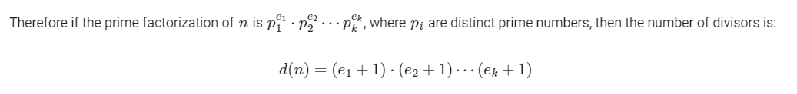

- The smallest prime factor is the smallest divisor of the number. 

## Formula to get number divisors of a number
- Number of divisors of a number 'n'
  - We can represent as prime factors, n = (prime1^x * prime2^y)
  - Number of divisors: (x + 1) * (y + 1)  
    

    ```cpp
    int countDivisors(int n) 
    { 
        int cnt = 0; 
        for (int i = 1; i <= sqrt(n); i++) { 
            if (n % i == 0) { 

                // If divisors are equal, 
                // count only one 
                if (n / i == i) 
                    cnt++; 
      
                else // Otherwise count both 
                    cnt = cnt + 2; 
            } 
        } 
        return cnt; 
    } 
    ```

