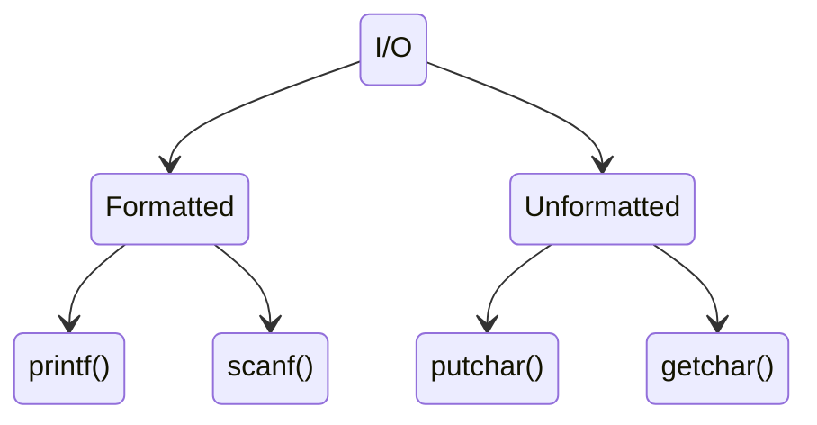

> # ```Function```

## <p align="center"><b>Functions role in algorithms</b></p>

1. Divide complexity into various minimal parts, thus work around those smaller portion make the algorithm to maintain DRY **(Don't Repeat Yourself)** principle and debug easily.
2. Algorithms expressed

Two types of function are seen in C and C++, these are:

1. **Built-in function**: C and C++ has many built in functions and methods (as for C++ STL) to reduce boilerplate and redundancy. Many popular algorithms are also written if form of built-in library function.

2. **User defined function**: Also known as sub-routines. Meanwhile, programmers construct . Here is three parts of user defined functions:
    - Function decleration
    - Function call
    - Function definition

## <p align="center"><b>I/O classification</b></p>



## <p align="center"><b>Time complexity</b></p>

Algorithm analysis requirements:
|  ```Terminology``` |
|:----:|
| Time complexity|
| Space complexity |
| Network consumption |
| Power consumption |

1. A program that has a lower time complexity will run faster compared to a program with a higher complexity.
2. Algorithm that requires less execution (lower in terms of time complexity) time expenditure more space. On the contrary, an algorithm with a higher space complexity will have a lower time complexity( require less execution time.)

    The greater the time complexity, the less space it would require.
    The greater the space complexity, the less its time complexity would be.

    Here is an example so see the difference in action:

    ```
    Example 1: Swapping without third variable
    a = a + b
    b = a - b
    a = a - b

    Example 2: Swapping using an extra variable
    t = a
    a = t
    b = t
    ```

    In the first example, we had to do a lot of calculation, that requires computation power which increases time complexity. On the other hand comparing with the second example, there was no calculation involved hence no computatoin has done. Rather it take an extra variable or space to do it's work.

3. An application with lower space complexity will typically have a shorter startup time

4. Computer can compute 10^3 operations at a second.

5.
