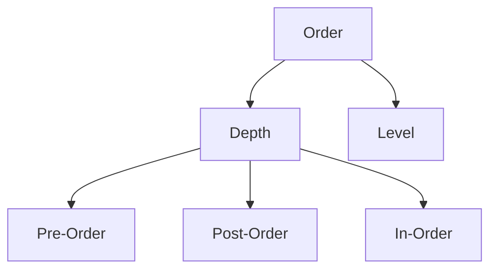

> # **```Tree```**

**Definition**: Tree or **N-ary tree** is a non-linear hierarchical data structure **consist of nodes where each node having zero or more nodes connected by edges**.

- A tree is a non-linear data structure.
- Tree data structure is a hierarchy structure.
- File system is a prominent example of tree data structure.
- Topmost level of a tree is consist of single node namely **root** node.
- Apart from the leaf nodes, all other nodes in a tree can be addressed as parent node to it's next level nodes connected to it.
- Nodes belongs to the last level of a tree is said to be **leaf** node. These leaf nodes can't have any child nodes, thus leaf nodes can't be parent.

### **How linked list is different from tree?**

> Linked list is a single directional and sequential data structure where one item or element or node references only one neighbor. Unlike linked list, each node of a tree can have link to multiple nodes connected to it.

## **Benefits**

1. Insertion and deletion operation are O(long N) complexity.
2. Ordered insertion and deletion in binary search tree (variation of tree).
3. Partial sorting.

## <p align="center">**Terminology**</p>


<ins>**Node**</ins>: A node is an entity that contains value and edges to it's child nodes.  
<ins>**Edge**</ins>: Edge is the link between two nodes. Edge implemented by pointer to next child nodes.  
<ins>**Root node**</ins>: The topmost node of the tree is called root node or **key**.  
<ins>**Parent node**</ins>: A node that that has at least one child associated with it is a parent node.  
<ins>**Child node**</ins>: Nodes that are connected to a parent nodes are said to be each others child node.  
<ins>**Leaf node**</ins>: The nodes with no children are called leaf node. Leaf nodes are not parent nodes.  
<ins>**Height of a node**</ins>: Number of edges from the node to it's deepest leaf.  
<ins>**Depth of a Node**</ins>: The depth of a node is the number of edges from the root to the node.  
<ins>**Height of a Tree**</ins>: The height of a Tree is the height of the root node or the depth of the deepest node.  
<ins>**Ancestors**</ins>: 

&nbsp;

### **Types of tree data structure:**

1. Binary tree
2. Binary search tree (BST)
3. AVL

> ## **```Binary tree```**

A generic tree or **N-ary tree** can have as many nodes as children, but in binary tree a node restricted to have atmost 2 childrens.

- Binary tree is used in machine learning algorithm as decision tree.
- To visualize binary search
- Compiler syntax tree implemented
- Heap sort

<ins>Traverse and print **Binary Tree**</ins>

Unlike linear data structures, the non-linear data structures can't be print in linear order fashion since it has multiple path to be traversed.

To traverse a binary tree there are mainly four such way to do, such as:

1. Pre order traversing: Root ➔ Left subtree ➔ Right subtree
2. In order traversing: Left subtree ➔ root ➔ Right subtree
3. Post order traversing: Left subtree ➔ Right subtree ➔ Root


## **```Variants of binary tree```**

1. **Full Binary Tree**: Count of child nodes either 0 or 2.
2. **Complete Binary Tree**: All levels are filled properly except for the last level filled from left to right sequentially. Complete binary tree isn't perfect but it tends to be perfect
3. **Perfect Binary Tree**: All levels needs to be filled up.

Each node can have atmost 2 nodes attached to it.  

A binary tree node contains these three fields:

1. Data
2. Pointer to left child
3. Pointer to right child

### Number of nodes in a full binary tree
Formula: 2^h - 1

### Height of a tree is the maximum depth