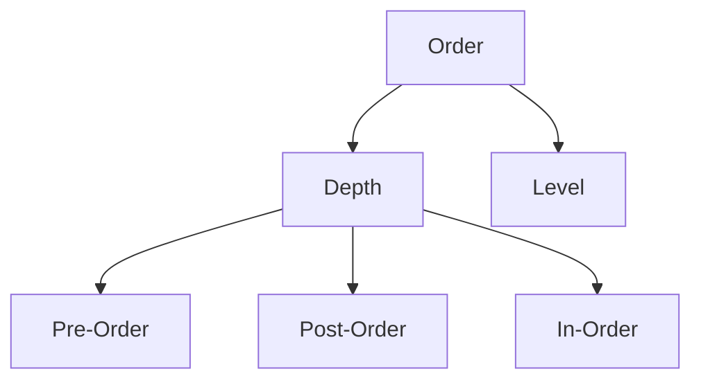

> # **```Tree```**

**Definition**: Tree or **N-ary tree** is a non-linear hierarchical data structure **consist of nodes where each node having zero or more nodes connected by edges**.

- A tree is a non-linear data structure.
- Tree data structure is a hierarchy structure.
- File system is a prominent example of tree data structure.
- Topmost level of a tree is consist of single node namely **root** node.
- Apart from the leaf nodes, all other nodes in a tree can be addressed as parent node to it's next level nodes connected to it.
- Nodes belongs to the last level of a tree is said to be **leaf** node. These leaf nodes can't have any child nodes, thus leaf nodes can't be parent.

### **How linked list is different from tree?**

> Linked list is a single directional and sequential data structure where one item or element or node references only one neighbor. Unlike linked list, each node of a tree can have link to multiple nodes connected to it.

## **Benefits**

1. Insertion and deletion operation are O(long N) complexity.
2. Ordered insertion and deletion in binary search tree (variation of tree).
3. Partial sorting.

## <p align="center">**Terminology**</p>


1. <ins>**Node**</ins>: A node is an entity that contains value and edges to it's child nodes.  

2. <ins>**Edge**</ins>: Edge is the link between two nodes. Edge implemented by pointer to next child nodes.  

3. <ins>**Root node**</ins>: The topmost node of the tree is called root node or **key**.  

4. <ins>**Parent node**</ins>: A node that that has at least one child associated with it is a parent node.  

5. <ins>**Child node**</ins>: Nodes that are connected to a parent nodes are said to be each others child node.  

6. <ins>**Sibling node**</ins>: If any two have the same parent node then they are said to be sibling nodes.   

7. <ins>**Leaf node**</ins>: The nodes with no children are called leaf node. Leaf nodes can't be parent nodes.

8. <ins>**Height of a tree**</ins>: The height of a tree is the height of the root node or the depth of the deepest node. In simple words, **maximum number of edges defines the height of a tree**.

9. <ins>**Height of a node**</ins>: Maximum number of edges from the node till the deepest leaf. 

10. <ins>**Depth of a Child Node**</ins>: The depth of a child node is the number of edges from the root to the child node.  

11. <ins>**Ancestors**</ins>: Every node that contains a child node is said to be an ancestor of it's immediet and further child nodes. 

12. <ins>**Tree Node Level**</ins>: **Height of the root node - Height of a target node**. Level of root is 0.

13. <ins>**Degree of a Node**</ins>: How many child node a node has defines it degree. If a node has 2 child then it has degree 2 (maximum is degree 2), is node contains 1 child then it has degree 1 and if it doesn't contain any child nodes then it has degree of 0. Leaf nodes degree is 0. 

&nbsp;

### **Types of tree data structure:**

1. Binary tree
2. Binary search tree (BST)
3. AVL

> ## **```Binary tree```**

A generic tree or **N-ary tree** can have as many nodes as children, but in binary tree a node restricted to have atmost 2 children nodes.

- Binary tree is used in machine learning algorithm as decision tree.
- To visualize binary search
- Compiler syntax tree implemented
- Heap sort

### Structure of a binary tree

A binary tree node contains these three fields:

1. Data
2. Pointer to left child
3. Pointer to right child

### <ins>Traverse and print **Binary Tree**</ins>

Unlike linear data structures, the non-linear data structures can't be print in linear order fashion since it has multiple path to be traversed.

To traverse a binary tree there are mainly four such way to do, such as:

1. Pre order traversing: Root ➔ Left subtree ➔ Right subtree
2. In order traversing: Left subtree ➔ root ➔ Right subtree
3. Post order traversing: Left subtree ➔ Right subtree ➔ Root


## **```Variants or types of binary tree```**

1. **Full or Strict Binary Tree (FBT)**: Each node has either 0 or 2 child nodes. We can form a complete binary of full binary tree. 
```
    Number of nodes in a full binary tree
    Formula: 2^h - 1
```

2. **Complete Binary Tree (CBT)**: All levels are filled properly except for the last level filled from left to right sequentially. Complete binary tree isn't perfect binary tree but it tends to be perfect binary tree. 

3. **Perfect Binary Tree (PBT)**: All the internal nodes strictly has 2 child nodes and the leaf nodes has to be in the same level.

4. **Height Balanced Binary Tree (HBBT)**: Height of tree must meet **log(number of tree nodes)**.

5. **Degenerate or Skewed Binary Tree (SBT)**: Every node has strictly one child node. Skewed binary looks like a linked list.

### Height of a tree is the maximum depth

&nbsp;

## **```Properties```**
### Height of a perfect binary tree (PBT)
Suppose, Height of a perfect binary tree = H  
Total number nodes in PBT = (2^(H + 1)) - 1   
Total number of leaf nodes in PBT = 2^H

### Levels count
If, N = number of leaves   
```Levels = log(N + 1)```

### Leaf nodes count in FBT
```Number of leaf nodes = Number of internal nodes + 1```

### Number of leaf nodes
```1 + Number of internal nodes with 2 childrens```

&nbsp;

## **```Implementation```**

1. Linked representation (Uses custom type and pointer/references)
2. Sequential (Uses array): Usecases like heap and segment tree (FBT).

&nbsp;
## **```Tree input and traversal```**
There are two ways we can input and traverse the tree:

### 1. DFS (Depth-First-Search) or depth wise

<!-- 1 -->
<details>
<summary>DFS or depth-wise Input</summary>

```cpp
Node *depth_wise_input(Node *root)
{
    int data;
    cout << "Enter data for node: ";
    cin >> data;

    if (data <= 0)
        return nullptr;

    Node *newNode = new Node(data);

    cout << "Left node data: ";
    root->leftChild = depth_wise_input(root->leftChild);

    cout << "Right node data: ";
    root->rightChild = depth_wise_input(root->rightChild);

    return root;
}
```
</details>

<!-- 2 -->
<details>
<summary>In Order Traverse</summary>

```cpp
void in_order_traverse(Node *root)
{
    if (!root)
        return;

    pre_order_traverse(root->leftChild);
    cout << root->data << ' ';
    pre_order_traverse(root->rightChild);
}
```
</details>

<!-- 3 -->
<details>
<summary>Post Order Traverse</summary>

```cpp
void post_order_traverse(Node *root)
{
    if (!root)
        return;

    pre_order_traverse(root->leftChild);
    pre_order_traverse(root->rightChild);
    cout << root->data << ' ';
}
```
</details>

<!-- 4 -->
<details>
<summary>Pre Order Traverse</summary>

```cpp
void pre_order_traverse(Node *root)
{
    if (!root)
        return;

    cout << root->data << ' ';
    pre_order_traverse(root->leftChild);
    pre_order_traverse(root->rightChild);
}
```
</details>

### 2. BFS (Breadth-First-Search) or level order
