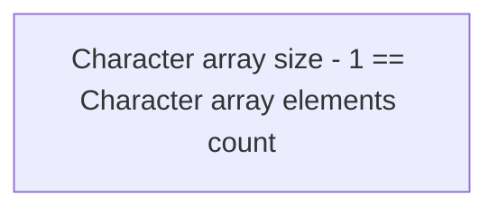

> # ```Module 10```

## <p align="center"><b>String</b></p>

An array of characters or sequence of characters (Single entity ASCII characters [32-127] in case of C and C++, modern languages support UNICODE) are said to be **string**.

Character arrays are different from integer or other types of arrays. Character represents a single unique entity. whereas numbers can contain multiple digits. So, in other types of arrays (like an integer array), it is important to make sure multiple elements are separated by spaces. But in the case of a character array, a space itself is a character, so character arrays don't require space to seperate between elements.

In the case of a character array, each element is distinct, so we don't need any sort of seperator for character arrays or strings. Whereas, an integer array element could have multiple digits. Here, we require something to separate multiple elements. For example, if 111 is an array element and 222 is another array element, if we don't put any space between 111 and 222, this will become 111222, which is also a single number. So, we require a space separator for only number type or non-character type of array.



Quiz:

1. For an array of size 10, how many valid elements user can input?
=> 10 - 1 = 9, an extra element is reserved for null character.
2. What does the null character  '\0'?
=> Indicates the end of a string.

3. How we can get integer value 8 from a character variable a='8'?
=> ```int ans = a - '0';```

4.

## <p align="center"><b>String Operations</b></p>

1. For string input '&' operator is not mandatory.
2. What is segmentation fault? => Acessing more size than allocated memory.
3. In Windows operating systems, extra memory is allocated. As a result, if more characters are inputted into a character array than its defined size, no error is displayed and the string is printed. However, in Linux operating systems, a segmentation or runtime error is shown in the same situation. Despite this difference, it is important to follow the correct method of inputting data and always careful to not exceed the predefined character array size.

```
char country[6];
scanf("%s", &country);

/// suppose input is 'Bangladesh' which exceeds 6 character. for windows operating system it won't show error

printf("%s", country);
```

### <p><b>String print with spaces</b></p>

**fgets()**  
<ins>**Required header file:**</ins> #include <string.h>  
fgets() also receives enter as a valid character input.

**Size vs Length of a string**  
Size: Size is defined in compiled time. How many characters are allocated for the string.
Length: Length is how many characters are there in a string.
